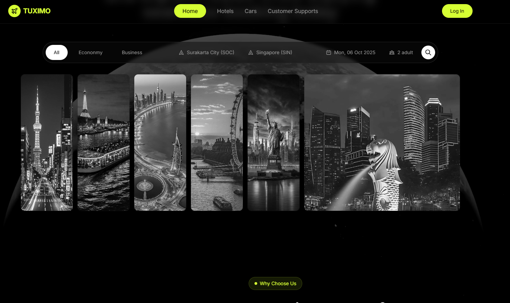

<div align="center">

# ✈️ TUXIMO - Premium Travel Booking Platform

### Your Gateway to Extraordinary Journeys

[](https://tuximo73.vercel.app)
[](https://react.dev)
[](https://www.typescriptlang.org/)
[](https://vitejs.dev)
[](LICENSE)

[🌐 Live Demo](https://tuximo73.vercel.app) • [📖 Documentation](./docs) • [🐛 Report Bug](https://github.com/Mostafa-SAID7/TUXIMO/issues) • [✨ Request Feature](https://github.com/Mostafa-SAID7/TUXIMO/issues)

</div>

---

## 🎯 About TUXIMO

TUXIMO is a modern, feature-rich travel booking platform that makes planning your next adventure effortless. Built with cutting-edge web technologies, it offers a seamless experience for booking flights, hotels, and car rentals.

### ✨ Key Features

- 🎨 **Beautiful UI** - Modern, responsive design with smooth animations
- ✈️ **Flight Booking** - Search and book flights to destinations worldwide
- 🏨 **Hotel Reservations** - Find and book accommodations
- 🚗 **Car Rentals** - Rent vehicles for your journey
- 📱 **Mobile Responsive** - Perfect experience on all devices
- ♿ **Accessible** - WCAG compliant components
- 🌙 **Dark Mode Ready** - Theme support built-in
- ⚡ **Lightning Fast** - Optimized performance with Vite

## 🚀 Live Demo

**URL**: [https://tuximo73.vercel.app](https://tuximo73.vercel.app)

## 📸 Screenshots

<div align="center">

### 🏠 Home Page


### ✈️ Flight Booking


### 🌍 Destinations


</div>

## 📋 Project Overview

TUXIMO is a premium travel booking platform designed to make travel planning simple and enjoyable. Whether you're booking a flight, reserving a hotel, or renting a car, TUXIMO provides an intuitive interface with powerful features.

### 🎯 Why TUXIMO?

- **Modern Stack** - Built with React 18, TypeScript, and Vite for optimal performance
- **Beautiful Design** - Crafted with Tailwind CSS and shadcn/ui components
- **Type Safety** - Full TypeScript coverage for reliable code
- **Accessibility First** - WCAG compliant components for all users
- **SEO Optimized** - Server-side rendering ready with React Helmet
- **Production Ready** - Comprehensive CI/CD with automated testing

## 🛠️ Technologies Used

<div align="center">

| Category | Technologies |
|----------|-------------|
| **Frontend** | React 18, TypeScript 5.8, Vite 5.4 |
| **Styling** | Tailwind CSS 3.4, shadcn/ui, Radix UI |
| **Routing** | React Router v7 |
| **Forms** | React Hook Form, Zod validation |
| **State** | TanStack Query (React Query) |
| **Animation** | Motion (Framer Motion) |
| **Icons** | Lucide React |
| **Video** | HLS.js |
| **Deployment** | Vercel |
| **CI/CD** | GitHub Actions |

</div>

## 🚀 Getting Started

### Prerequisites

- **Node.js** 18+ and npm - [Install with nvm](https://github.com/nvm-sh/nvm)
- **Git** - [Download here](https://git-scm.com/)

### Quick Start

```bash
# Clone the repository
git clone https://github.com/Mostafa-SAID7/TUXIMO.git

# Navigate to project
cd TUXIMO

# Install dependencies
npm install

# Start development server
npm run dev
```

Visit `http://localhost:5173` to see the app running!

## 📜 Available Scripts

| Command | Description |
|---------|-------------|
| `npm run dev` | Start development server with HMR |
| `npm run build` | Build optimized production bundle |
| `npm run build:dev` | Build development bundle |
| `npm run lint` | Run ESLint for code quality |
| `npm run preview` | Preview production build locally |

## 🎨 Features

### Core Features
- ✈️ **Flight Search & Booking** - Search flights with date pickers and filters
- 🏨 **Hotel Reservations** - Browse and book accommodations
- 🚗 **Car Rentals** - Rent vehicles for your trips
- 🌍 **Popular Destinations** - Explore trending travel locations
- 💬 **Customer Testimonials** - Real reviews from travelers
- 📱 **Fully Responsive** - Optimized for mobile, tablet, and desktop

### Technical Features
- ⚡ **Lightning Fast** - Vite for instant HMR and optimized builds
- 🎯 **Type Safe** - Full TypeScript coverage
- ♿ **Accessible** - WCAG compliant UI components
- 🔍 **SEO Optimized** - Meta tags and sitemap included
- 🎭 **Smooth Animations** - Motion-powered transitions
- 🎨 **50+ UI Components** - Complete shadcn/ui library
- 📊 **Form Validation** - React Hook Form with Zod schemas
- 🔒 **Secure** - Regular security scans and updates

## 🚢 Deployment

### Deploy to Vercel (Recommended)

[](https://vercel.com/new/clone?repository-url=https://github.com/Mostafa-SAID7/TUXIMO)

1. Click the button above
2. Sign in to Vercel
3. Deploy with one click

### Manual Deployment

```bash
# Install Vercel CLI
npm install -g vercel

# Deploy
vercel
```

## 🤝 Contributing

We welcome contributions! Here's how you can help:

1. 🍴 **Fork the repository**
2. 🌿 **Create a feature branch** (`git checkout -b feature/amazing-feature`)
3. 💾 **Commit your changes** (`git commit -m 'Add amazing feature'`)
4. 📤 **Push to the branch** (`git push origin feature/amazing-feature`)
5. 🎉 **Open a Pull Request**

Please read our [Contributing Guidelines](./docs/CONTRIBUTING.md) for details.

## 📝 License

This project is licensed under the MIT License - see the [LICENSE](LICENSE) file for details.

## 🌟 Show Your Support

If you find this project useful, please consider:

- ⭐ **Starring the repository**
- 🍴 **Forking it for your own projects**
- 📢 **Sharing it with others**
- 🐛 **Reporting bugs or suggesting features**

## 📞 Contact & Links

- **Live Site**: [tuximo73.vercel.app](https://tuximo73.vercel.app)
- **Repository**: [github.com/Mostafa-SAID7/TUXIMO](https://github.com/Mostafa-SAID7/TUXIMO)
- **Issues**: [Report a bug or request a feature](https://github.com/Mostafa-SAID7/TUXIMO/issues)
- **Author**: [Mostafa SAID](https://github.com/Mostafa-SAID7)

## 🙏 Acknowledgments

- [React](https://react.dev) - UI library
- [Vite](https://vitejs.dev) - Build tool
- [Tailwind CSS](https://tailwindcss.com) - Styling
- [shadcn/ui](https://ui.shadcn.com) - UI components
- [Radix UI](https://www.radix-ui.com) - Primitives
- [Lucide](https://lucide.dev) - Icons
- [Vercel](https://vercel.com) - Hosting

---

<div align="center">

**Made with ❤️ by [Mostafa SAID](https://github.com/Mostafa-SAID7)**

⭐ Star this repo if you find it useful!

</div>
